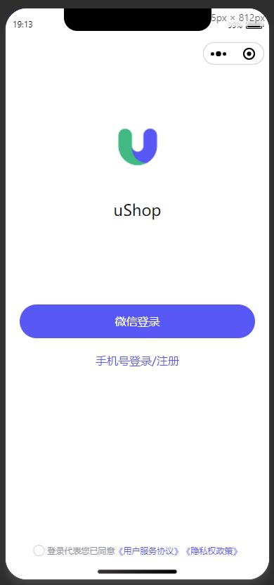
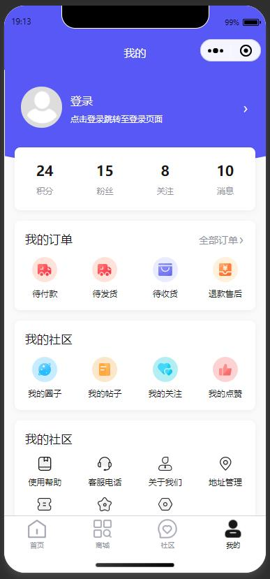
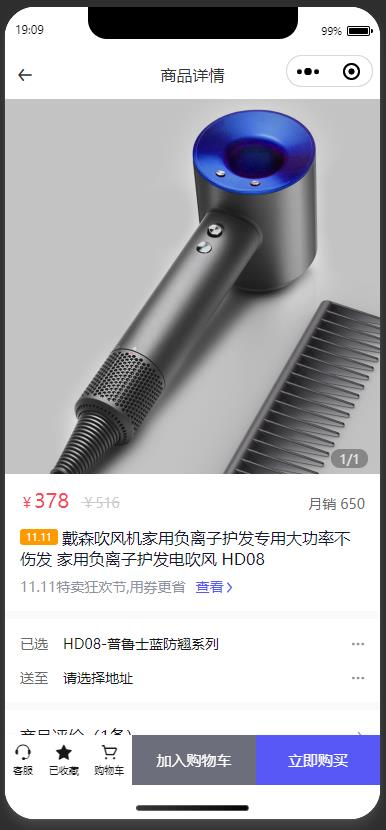
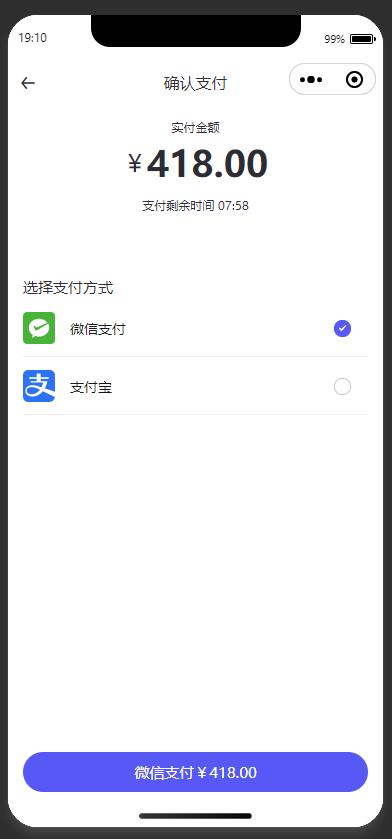
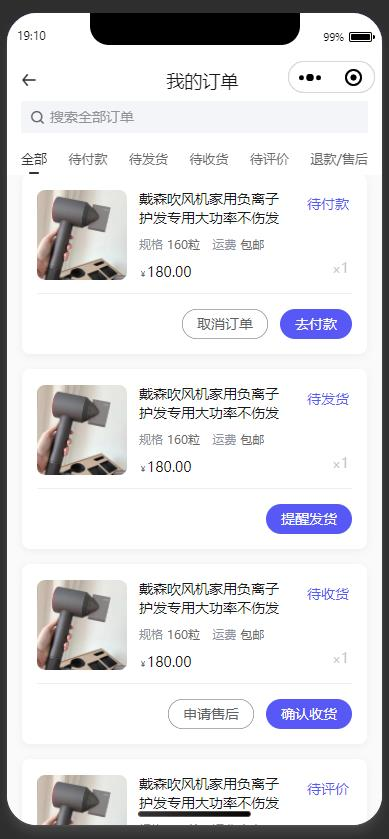
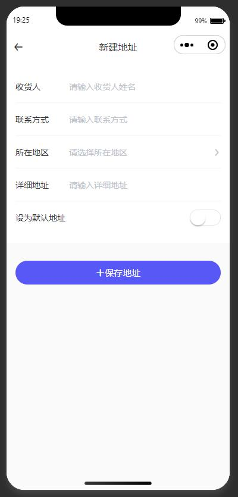
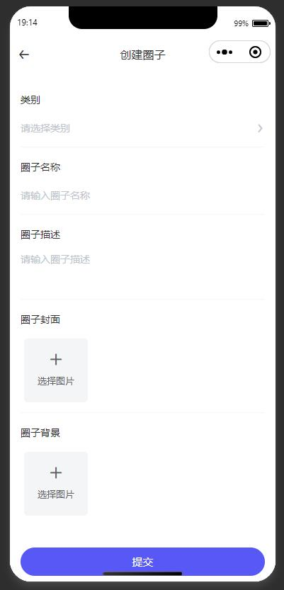
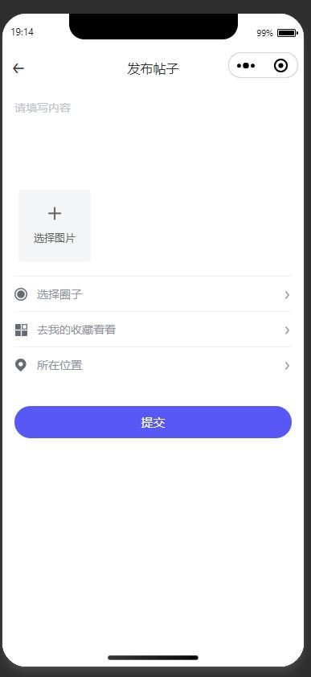

<div align="center">
  <a href="https://github.com/kaivanwong/u-shop" target="_blank">
    
  </a>
</div>

<div align="center">
  <h1>uShop 友商城</h1>
  <div>
  
  基于 Uniapp 开发，面向社区电商场景的微信小程序模板，涵盖商品、订单、用户、社区和积分商城等内容。页面均使用组件化开发，代码维护性高，您可以使用该模板页面进行业务快速开发。

[](./LICENSE)
[](https://github.com/kaivanwong/u-shop)

  </div>
</div>

### ✨ 特性

- 基于 uniapp 的移动跨端技术，一套代码实现 App、小程序、H5、轻应用等；

- 提供面向社区电商场景的微信小程序模板，如商品、订单、社区等页面；

- 基于 uview-ui 组件库，采用组件化开发，封装大量业务组件，维护性高；

- 灵活的分包策略（目前由于静态图片资源占比较大，无法发布），可灵活搭配页面；

- 基于成熟的产品设计，拥有统一的 UI 设计及界面风格，可以直接接入逻辑使用；

- 应用使用 Sass 主题变量，将颜色、文字、阴影等进行抽离，可快速修改主题；


### 📌 功能页面

- [x] 登录/注册页面、微信登录页面

- [x] 首页推荐（地区选择、金刚区、商品、帖子推荐）

- [x] 商品分类/列表

- [x] 商品详情（SKU、评价、精选晒单、推荐）

- [x] 购物车功能

- [x] 下单界面（收货地址维护、优惠卷，支付界面）

- [x] 我的订单（详情、取消、付款、申请售后、评价、物流等）

- [x] 个人中心（设置、个人首页）

- [x] 社区模块（圈子、帖子）

- [x] 创建圈子、帖子页面

- [x] 我的关注、粉丝、社区、点赞

- [x] 我的收藏、我的优惠卷、收货地址维护

- [x] 积分商城模块

### 💥 界面展示

由于本地静态图片较多，暂时未上线发布，您可以参考图片或者 Clone 代码后运行。

<table>
    <tr>
        <td></td>
        <td></td>
        <td></td>
    </tr>
    <tr>
        <td></td>
        <td></td>
        <td></td>
    </tr>
    <tr>
        <td></td>
        <td></td>
        <td></td>
    </tr>
    <tr>
        <td></td>
        <td></td>
        <td></td>
    </tr>
    <tr>
        <td></td>
        <td></td>
        <td></td>
    </tr>
    <tr>
        <td></td>
        <td></td>
        <td></td>
    </tr>
</table>

### 🌈 使用

#### 1. 目录说明

```sh
/api # 基于 uview-ui 的请求处理，以及模块化管理 api
/components # 全局组件
/mixins # 全局混入方法
/pages # 主包
/pages-mall # 电商副包
/pages-mine # 我的副包
/pages-community # 社区副包
/pages-points # 积分商城副包
/static # 静态资源
/utils # 工具函数
/store vuex # 全局状态管理
/uview-ui # uview-ui 包
App.vue # 根组件，配置 uniapp 应用生命周期及全局 data
main.js # 入口文件，禁止不必要的全局引入
manifest.json # uniapp 应用配置
pages.json # uniapp 页面配置
template.h5.html #  h5 渲染模板
theme.scss # app 主题配置
uni.scss # 全局 scss 变量，注意此文件不要放置样式文件，仅限于 scss 变量
vue.config.js # webpack 配置
```

#### 2. uview-ui，[点我访问 uview-ui 1.x](https://v1.uviewui.com/)

针对业务需要，对 uview-ui 组件进行了部分修改，请勿直接从官网下载全部替换。修改的功能列表如下：

- u-waterfall 增加了左右两列边距的参数，marginLeft、marginRight
- u-search 增加了调节圆角大小的参数，borderRadius
- u-button 增加了 dark、white 配色，增加了 small 的 size，节流默认值由 1000 调整为 400
- theme.scss 修改了 primary 配色，增加了 dark 配色
- u-input 增加了 selectIconName 参数，可以自定义 type='select'模式下的右侧图标
- u-upload 增加了删除图片 modal 的确认按钮颜色参数，deleteConfirmBtnColor

#### 3. Api 管理以及请求方法

避免重复封装，导致不必要的体积增长，使用基于 uview-ui 的 api 请求方法，再此基础上做了二次封装。

api 采用模块化管理，目录：/api/modules

```
使用方法：第一项为url，第二项为入参，第三项为header
export const xxxApi = (Vue, vm) => {
	return {
		xxxx: (code) => vm.$u.get('/xxx/xxx', {
			code
		},{token:xxx}),
	}
}
```

如何在页面中使用？

```
使用方法：this.$u.api.xxxx(xxx)
```

关于拦截器以及请求配置，目录：/api/config.js

```
请求地址：HTTP_URL_DEV / HTTP_URL_PROD
请求前缀：HTTP_URL_DEV_PREFIX / HTTP_URL_PROD_PREFIX
uview-ui 的请求配置：UVIEWUI_HTTP_CONFIG
请求拦截器：httpRequest
响应拦截器：httpResponse
```

自定义请求封装，目录：/api/custom-request.js

#### 4. vuex 状态管理

- user 模块

包括了用户登录、退出、微信登录、定位等常用方法封装及状态持久

#### 5. mixins 全局混入

- smsCode.js 验证码获取方法

#### 6. utils 工具函数

- location.js 微信定位（含坐标转位置详情，需配置）

#### 7. 修改主题色

- 修改 uview-ui 的颜色配置

```
目录：/uview-ui/theme.scss

$u-main-color: #303133;
$u-content-color: #606266;
...

直接修改主题颜色即可
```

- 修改 fun-uniapp 的颜色配置

```
目录：/theme.scss
$app-theme-color: #5758f6;
$app-theme-bg-color: #ffffff;
...

直接修改主题颜色即可
```

- 其他的主题色配置

```
uniapp的pages.json配置

"tabBar": {
	"color": "#333",
	"selectedColor": "#333",
	...
},
```

### 开源协议

[MIT licensed](./LICENSE) © 2022-PRESENT Kaivan Wong
